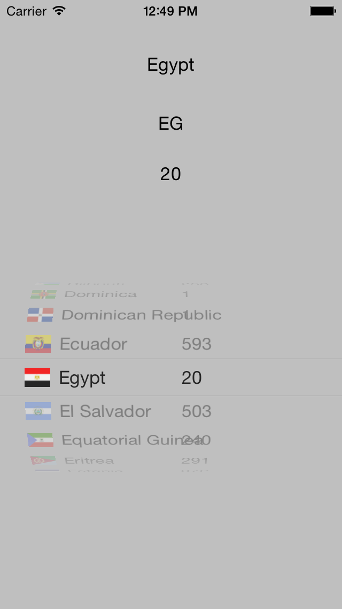

Purpose
--------------

CountryPicker is a custom UIPickerView subclass that provides an iOS control allowing a user to select a country from a list. It can optionally display a flag next to each country name, and the library includes a set of 249 public domain flag images from https://github.com/koppi/iso-country-flags-svg-collection that have been renamed to work with the library.

Note that the list of countries is based on the ISO 3166 country code standard (http://en.wikipedia.org/wiki/ISO_3166-1). This list excludes certain smaller countries, regarding them as part of a larger state. For example, England, Scotland, Wales and Northern Ireland are lumped together as Great Britain. For most purposes this is fine as it matches the convention used for locales, but if you need to specify additional countries, you can subclass and modify the countires list as described under "Subclassing" below.

Supported iOS & SDK Versions
-----------------------------

* Supported build target - iOS 10.0 (Xcode 8.0, Apple LLVM compiler 8.0)
* Earliest supported deployment target - iOS 6.0
* Earliest compatible deployment target - iOS 5.0

NOTE: 'Supported' means that the library has been tested with this version. 'Compatible' means that the library should work on this iOS version (i.e. it doesn't rely on any unavailable SDK features) but is no longer being tested for compatibility and may require tweaking or bug fixes to run correctly.

ARC Compatibility
------------------

As of version 1.1, CountryPicker requires ARC. If you wish to use CountryPicker in a non-ARC project, just add the -fobjc-arc compiler flag to the CountryPicker.m file. To do this, go to the Build Phases tab in your target settings, open the Compile Sources group, double-click CountryPicker.m in the list and type -fobjc-arc into the popover.

If you wish to convert your whole project to ARC, comment out the #error line in CountryPicker.m, then run the Edit > Refactor > Convert to Objective-C ARC... tool in Xcode and make sure all files that you wish to use ARC for (including CountryPicker.m) are checked.

Installation
--------------

To use the CountryPicker in an app, just drag the CountryPicker class files into your project. If you want to use the flag icons, drag the CountryPicker.bundle folder in also.

Alternatively, you can install CountryPicker using Cocoapods or Carthage,

Subclassing
------------------

As of version 1.0.2 you can easily subclass CountryPicker to modify the country name/code list.

To add additional countries, override the +countryNamesByCode method (there is no need to override +countryCodesByName as this is derived automatically from +countryNamesByCode).

To change the display order, or display duplicate copies of (say) US or UK at the top of the list, override +countryNames method (there is no need to override +countryCodes as this is derived automatically from +countryNames and +countryCodesByName).

Release notes
------------------

Version 1.3

- Updated project for Xcode 8
- You can now override the font used by the picker labels
- Country sorting is now correct for localized names
- Flag images are now loaded from the correct bundle
- Added Carthage support

Version 1.2.3

- Moved flag images into a resource bundle

Version 1.2.2

- Added workaround for simulator bug where currentLocale doesn't return country names

Version 1.2.1

- Updated for iOS 8
- Now compliant with -Weverything warning level

Version 1.2

- Removed Countries.plist - country list is now generated automatically
- Country names are now localized
- Added ability to set and get country using locale
- Removed the setWithLocale: method

Version 1.1

- Updated for iOS 7 compatibility
- Added new "flat" flag images for iOS 7
- Now requires ARC (see README for details)
- Now compliant with -Wall and -Wextra warning levels

Version 1.0.2

- Capitalized Japan
- Added South Sudan
- Refactored to make subclassing easier

Version 1.0.1

- Added ARC support
- Added example project

Version 1.0

- Initial release